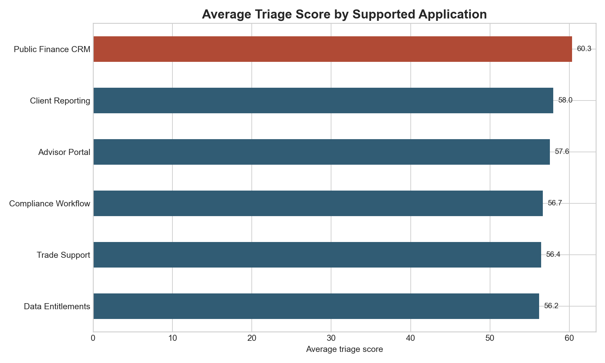
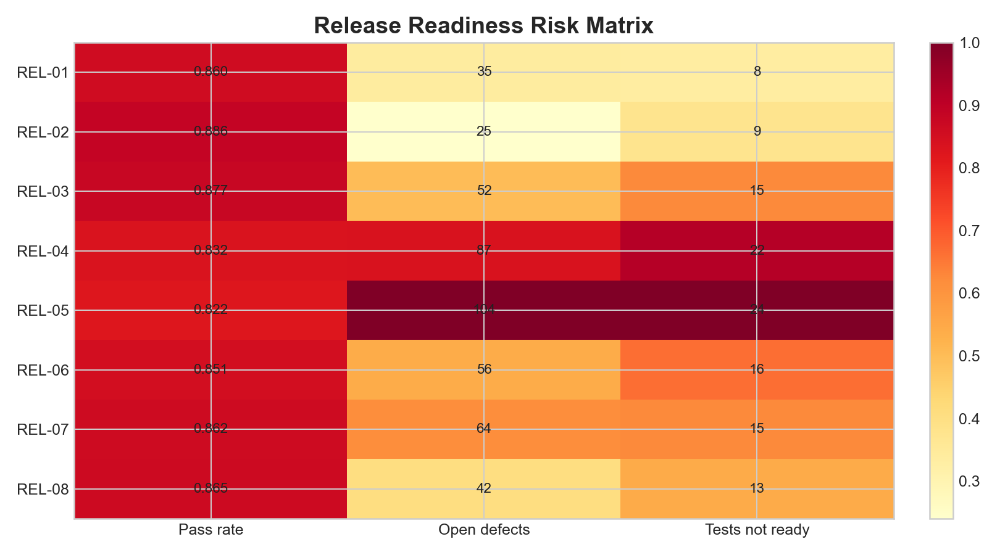
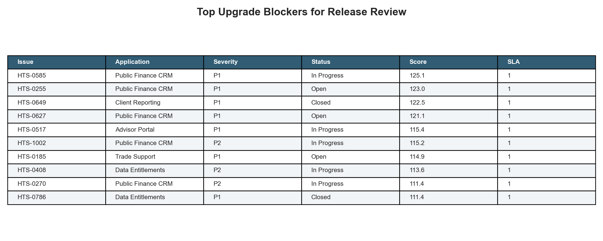

# Financial Product Support Triage Workbench

## Why This Exists

Financial product teams need a practical way to decide which application issues should move first when the queue mixes severity, customer effort, stale open items, vendor blockers, and release-readiness risk. This project turns source-style operational data into a ranked triage queue, release readiness view, and recommendation set for product support reviews.

## What This Project Is

This is a non-web analysis workbench for financial product support operations. It models a Service Center-style workflow where product analysts translate open issues, user group feedback, vendor dependencies, product requirements, and release test requests into prioritized system improvements.

## Why This Problem Matters

Open application issues are rarely comparable at first glance. A P2 defect with a stale vendor dependency can block a release more than a fresh P1 issue that already has an owner. A good product support workflow needs a repeatable way to weigh SLA risk, recurrence, affected users, customer effort, and release readiness before status updates or user-group meetings.

## Data And Evidence Used

- `data/` contains five source-style CSVs: support issues, product requirements, test requests, user groups, and vendor dependencies.
- Synthetic data is generated deterministically with a fixed seed and documented in `data_dictionary.md`.
- The generated dataset contains more than 1,000 total rows across source-style operational tables.
- `analysis/sql_checks.sql` documents warehouse-style checks for SLA aging, defect recurrence, release readiness, and vendor blockers.

## How The Project Works

1. Generate source-style support operations data with `scripts/generate_data.py`.
2. Score each issue using severity, SLA breach pressure, recurrence, affected users, customer effort, and vendor blocker status.
3. Export ranked queues and KPI summaries to `analysis/outputs/`.
4. Render evidence images into `docs/images/` so the work can be inspected without running the script.
5. Use `analysis/executive_findings.md` for the stakeholder readout and recommended operating motion.

## Outputs And Evidence

### Triage Score By Application



This chart shows which supported applications concentrate the highest combined severity, SLA, recurrence, user-effort, and vendor-blocker risk.

### Release Readiness Risk Matrix



This matrix compares pass rate, open defects, and not-ready tests across releases so product support can decide where to escalate before signoff.

### Top Upgrade Blockers



This ranked table gives a meeting-ready view of the highest-priority issues to review before user group updates and release planning.

## What The Analysis Says

- Highest-risk issues tend to combine old SLA age, recurrence, and vendor blockers rather than severity alone.
- Release readiness should be reviewed alongside open issue severity, because several high-score blockers connect directly to not-ready tests.
- The triage score is most useful as a review queue, not an automated decision rule; product owners still need context from user groups and vendors.

## Recommendations

1. Review the top 25 upgrade blockers before the next release readiness meeting.
2. Convert recurring high-score issue clusters into product requirements with acceptance criteria.
3. Escalate high-risk vendor dependencies before release signoff rather than after user group feedback.
4. Track SLA breach rate, average hours open, and customer effort as Power BI-ready product support KPIs.

## Repository Structure

```text
.
├── analysis/
│   ├── analysis_plan.md
│   ├── executive_findings.md
│   ├── outputs/
│   └── sql_checks.sql
├── data/
├── docs/images/
├── scripts/generate_data.py
├── src/triage_model.py
├── data_dictionary.md
├── README.md
└── STATUS.md
```

## How To Run Or Inspect

```bash
python3 -m pip install -r requirements.txt
python3 scripts/generate_data.py
```

The script writes source tables, ranked outputs, KPI summaries, and rendered evidence images using a fixed random seed.

## Caveats And Limitations

- The data is synthetic and designed to represent a realistic support operations workflow, not a real broker-dealer system.
- SLA thresholds, effort scores, and triage weights are illustrative and should be calibrated against real support history before production use.
- The analysis intentionally stays in a reproducible workbench format rather than a dashboard so the ranking logic remains easy to inspect.
